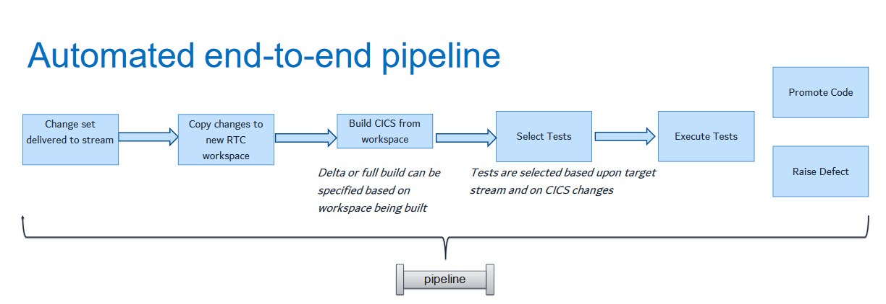

## What is DevOps?
The DevOps strategy aims to enable the development of high-quality software within a shortened development life-cycle. The strategy uses the concept of a continuous delivery pipeline to deploy software, with the focus on the DevOps practices of continuous testing and continuous deployment. Continuous testing involves running automated tests as early and often as possible. Continuous deployment automates the provisioning and deployment of new builds, enabling continuous testing to happen quickly and efficiently. The over-arching goal of the continuous delivery pipeline is the creation of a repeatable, reliable process that enables application changes to flow automatically from development into production.

## How Cirillo fits into the DevOps pipeline
Cirillo's focus is on the continuous testing part of the pipeline, specifically around the provision of scalable test automation for regression. When an application is created or updated, the code must successfully run through a relevant suite of Cirillo regression tests before it can move along the delivery pipeline. If the code passes all the tests, you can have confidence that the production deployment will be successful. The following image illustrates how the automated end-to-end pipeline process works in CICS:

 
Cirillo supports a "shift left" approach to testing, enabling tests to run simultaneously across different environments. These test suites can be triggered to run whenever a change set is delivered.

